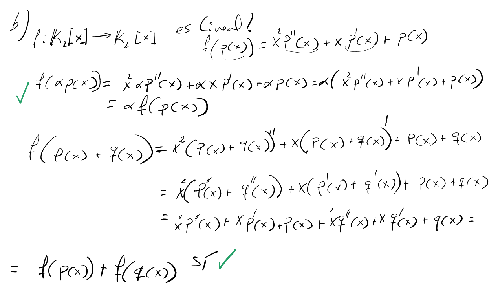
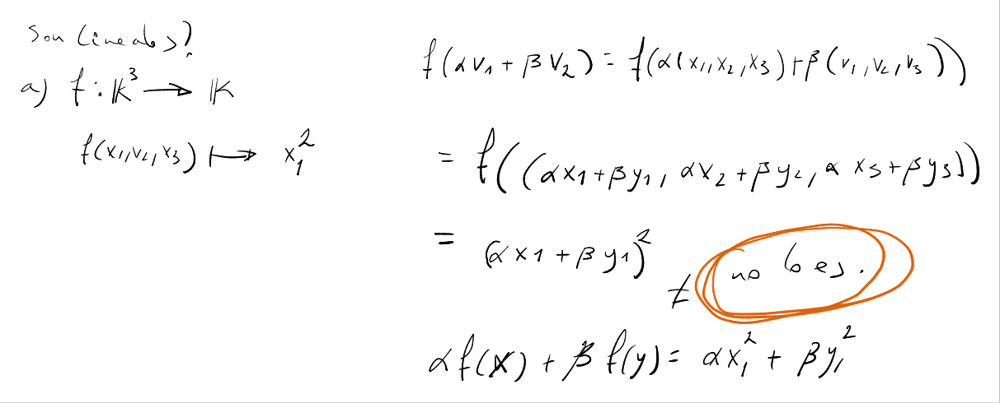
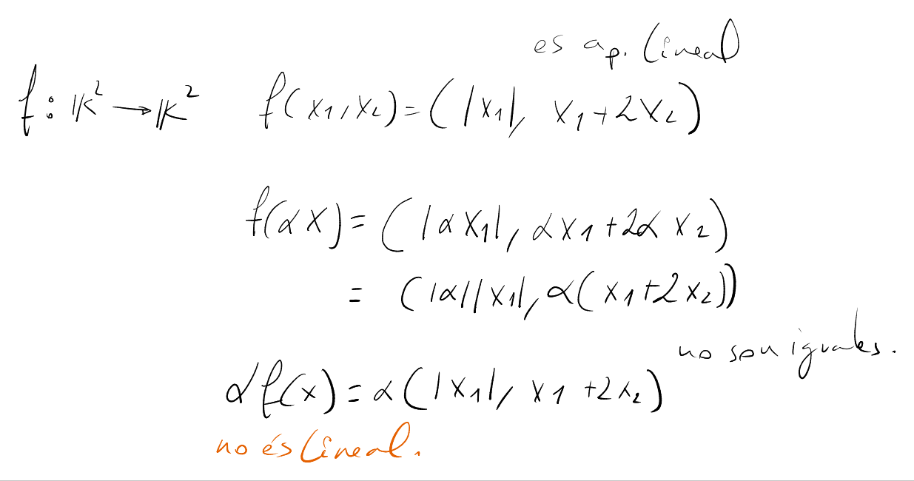
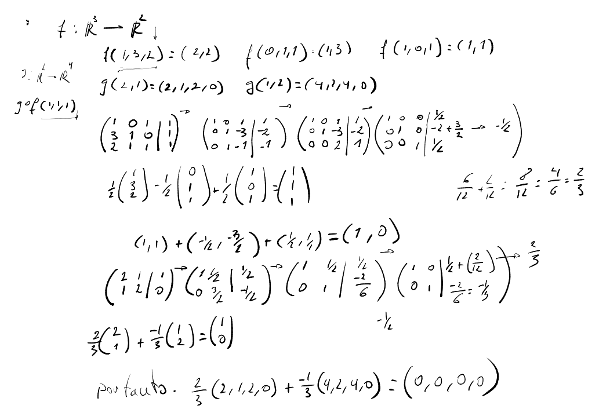
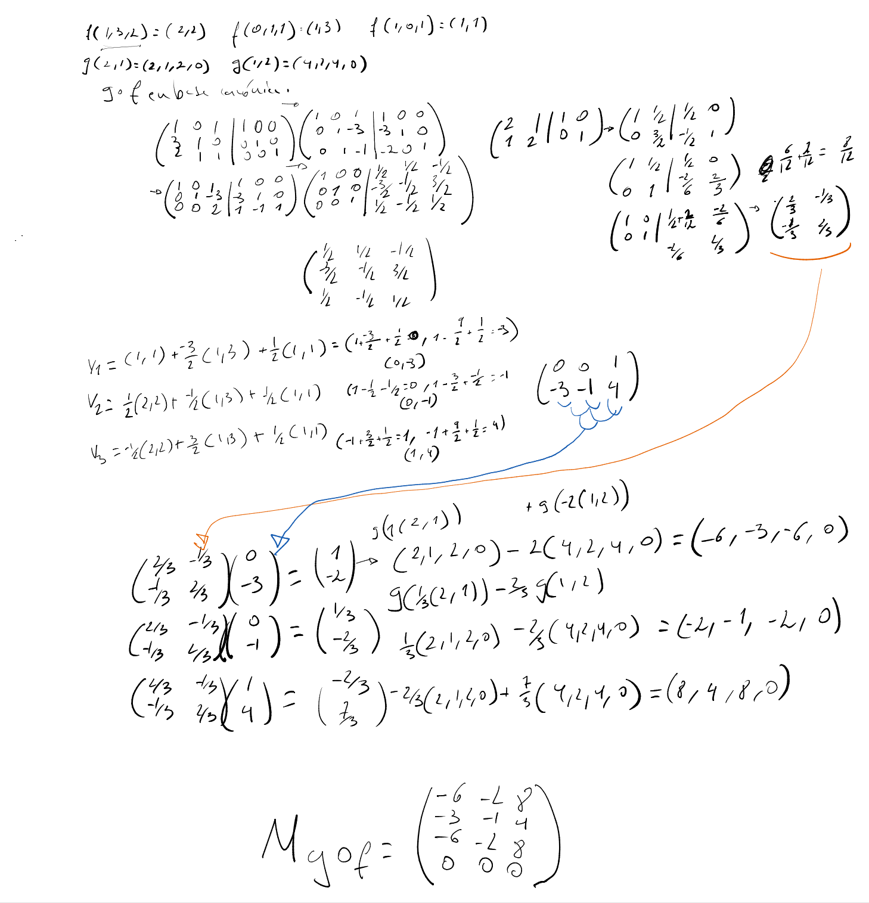

#+title: Álgebra Lineal
#+author: Jordi Amposta Pérez
#+startup: latexpreview content

* Matrices
- *Matrices congruentes* [[id:AlgbLin]] pag 46
      - $A$ y $B$ son congruentes si existe una Matriz P del mismo orden tal que.
      - $B=P^tAP$
      - Además $rg(A) = rg(AP) = rg(P^tAP) = rg(B)$
- *Matrices Semejantes*
      - $A$ y $B$ son semejantes si existe una Matriz $P$ del mismo orden tal que.
      - $B = P^{-1}AP$
      - además $rg(A) = rg(AP) = rg(P^{-1}AP) = rg(B)$

* Espacios Vectoriales
- Cálculo de *ecuaciones implícitas* de un espacio vectorial [[id:AlgbLin]] pag 136

* Aplicaciones Lineales
- $f: U \to V$
  $\dim(U) = \dim(Ker(f)) + \dim(Im(f))$

** Endomorfismo
- Es una palicación lineal de un espacio vectorial en si mismo.
      - $f: V \to V$

** Proyecciones y simetrías
# TODO

** Espacio Dual
- *Forma lineal*, aplicación lineal de $V$ en $\mathbb{K}$.
      - $f: V \to \mathbb{K}$
- *Espacio Dual*, conjunto de formas lineales de $V$.
      - $V^* = \mathcal{L}(V,\mathbb{K}) \simeq \mathfrak{M}_{1 \times n}$

** Ejercicios

* Aplicaciones Lineales

** Endomorfismos
- Las matrices de un endomorfismo en distintas bases son semejantes.
- $\mathfrak{M}_{B'}(f) = \mathfrak{M}_{BB'} \mathfrak{M}_B(f) \mathfrak{M}_{B'B}$
      - En palabras : Cojemos $v_{B'}$ lo transformamos en $v_{B}$ aplicamos la transformación y devolvemos el resultado a $B'$.

* Formas Canónicas de endomorfismos
- [[id:AlgbLin]] pag 199

** Autovalores y autovectores. Endomorfismos diagonalizbales
- [[id:AlgbLin]] pag 207
- Sean $\lambda_1 \dots \lambda_r$ autovalores del endomorfismo $f$ de $V$, con $dimV=n$.
- *Multiplicidad algebraica* : multiplicidad de la raiz $\lambda_i$ del polinomio característico.
      - Se denota por $a_i$.
      - $\lambda_i$ es un autovalor.
- *Multiplicidad Geométrica* : Dimensión del subespacio asociado $V_{\lambda}$.
      - Se denota por $g_i$.
      - $g_i = dim V_{\lambda_i} = n - rg(A - \lambda_i I)$
            - $g_i \geq 1$
- La multiplicidad algebraica de un autovalor es igual o mayor que la multiplicidad geométrica.
- $f$ es diagonalizable si:
      - $a_1 + \dots + a_k = n$
      - $a_i = g_i$ para cada valor $\lambda_i$

** Forma canónica de Jordan
- [[id:AlgbLin]] pag 211

- Sea $\lambda$ un autovalor de $f$.  
      - Bloque Jordan de orden 2
\begin{equation*}
B_2 = \left( \begin{array}{cc}
\lambda & 0 \\
1       & \lambda
\end{array} \right)
\end{equation*}

      - Bloque Jordan de orden 3

\begin{equation*}
B_3 = \left( \begin{array}{ccc}
\lambda & 0       & 0 \\
1       & \lambda & 0 \\
0       & 1       & \lambda
\end{array} \right)
\end{equation*}

- Matriz Jordan con 2 Bloques Jordan.
  
\begin{equation*}
J = \left(\begin{array}{cc|cc}
  \lambda  & 0        & 0    & 0 \\
  1        & \lambda  & 0    & 0 \\ \hline
  0        & 0        & \mu  & 0 \\
  0        & 0        & 1    & \mu
\end{array} \right)
\end{equation*}

- Un autovalor $\lambda_i$ tiene tantos bloques Jordan como su multiplicidad geométrica $g_i$.
      - Se debe igualar la multiplicidad algebraica en la diagonal de la matriz Jordan.
- Un subespacio $U$ de $V$ es *invariante* por un endomorfismo $f$ de $V$, o $f-invariante$, si se cumple $f(U) \subseteq U$.
      - Si $U=L(v_1, \dots, v_k)$ entonces $f(v_i) \in U$, $i=1 \dots k$.
- Sean $f$ un endomorfismo de $V$, $U_1,\dots,U_k$ subespacios de $V$ invariantes por $f$, y $B_i$ una base de $U_i$, $i \in 1,\dots, k$.
      - Si $V=U_1 \oplus \dots \oplus U_k$
      - Entonces $f$ respecto a $B=B_1 \cup \dots \cup B_k$ de $V$ Es una matriz diagonal por bloques.
      - [[id:AlgbLin]] pag 212

- Se denomina *Subespacio propio generalizado* i-ésimo asociado a un autovalor $\lambda$ de un endomorfismo $f$ al subespacio vectorial:
      - $K^i(\lambda) = Ker(f-\lambda Id)^{i}$ para $i = 1,2,\dots$
      - El subespacio propio generalizado $K^1(\lambda) = V_{\lambda}$
      - $M(\lambda)$ es el subespacio $K^i(\lambda)$ máximo.
            - $dim M(\lambda) = a_{\lambda}$.
- Propiedades de *Subespacio propio generalizaods* ([[id:AlgbLin]] pag 218)
      - Los subespacios propios generalizados son f-invariantes.
      - ...
- *Base asociada a un bloque de Jordan* de orden n: ([[id:AlgbLin]] pag 215)
      - $B=\{v_1, (f-\lambda Id)(v_1), \dots, (f-\lambda Id)^{n-1}(v_1)\}$
            - $v_1 \in Ker(f-\lambda Id)^n - Ker(f - \lambda Id)^{n-1}$
            - $v_i \in ker(f - \lambda Id)^r - ker(f-\lambda Id)^{r-1}$
                  - generalizando, siendo $v_i$ un vector del subpespacio $k^r$ no presente en $k^{r-1}$.
                  - $v_i$ forma parte de la base asociada a un blque Jordan.
                  - El conjunto de bases forman la matriz $P$ tal que $P^{-1}AP=J$.

- Construcción de la base $P$ tal que $P^{-1}AP = J$
  | dim | dim k^1             |         | ... |         | dim k^n = a_{\lambda}     |   | dimensión de cada subespacio k^i(\lambda)                        |
  |-----+---------------------+---------+-----+---------+---------------------------+---+------------------------------------------------------------------|
  |     | K^1(\lambda)        | \subset | ... | \subset | k^n(\lambda) = M(\lambda) |   | De cada subespacio K^n se cogen (dim k^n - dim k^{n-1}) vectores |
  |-----+---------------------+---------+-----+---------+---------------------------+---+------------------------------------------------------------------|
  |     | v_n                 |         | ... |         | v_1                       |   | Cada fila Está asociada a un bloque Jordan de la matriz J        |
  |     | (posible) v_{n+1+m} |         | ... |         | (posible) v_{n+1}         |   | g_{\lambda} es igual al número de filas de vectores              |
              
- *Espacio r-cíclico*.
      - Sea $\lambda$ un autovalor del endomorfismo $f$ de $V$.
      - Y $v \in Ker(f-\lambda Id)^r - Ker(f-\lambda Id)^{r-1}$ con $r \geq 1$.
      - Entonces $L(v, (f-\lambda Id)(v), \dots, (f-\lambda Id)^{r-1}(v))$ es el espacio r-cícliclo.

- si $B=\{v_1, \dots, v_n\}$ tal que $\mathfrak{M}_B(f)=B_n(\lambda)$
      - Entonces si $B' = \{v_n, \dots, v_1\}$ $\mathfrak{M}_{B'}(f) = B_n(\lambda)^t$
      - $\left(\begin{array}{cc} 0 & 1 \\ 1 & 0 \end{array}\right) \left(\begin{array}{cc} \lambda & 0 \\ 1 & \lambda \end{array}\right) \left(\begin{array}{cc}0 & 1 \\ 1 & 0\end{array}\right) = \left(\begin{array}{cc}\lambda & 1 \\ 0 & \lambda \end{array}\right)$

* Bibliografía
** Algebra Lineal y Geometría Vectorial
:PROPERTIES:
:ID: AlgbLin
:EDITORIAL: Sanz y Torres
:AUTHOR: Alberto Borobia Vizmanos, Beatriz Estrada López
:END:

