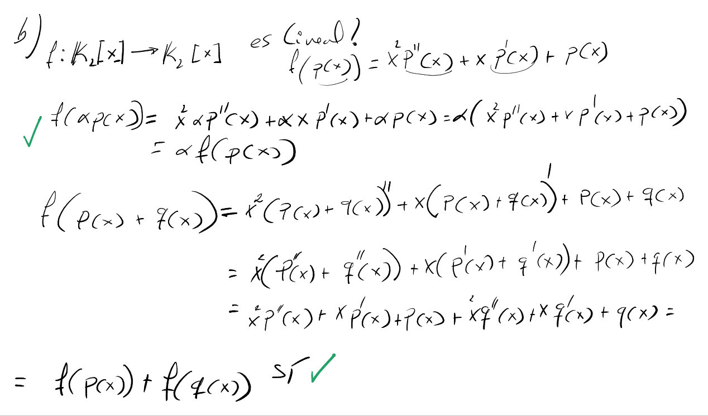
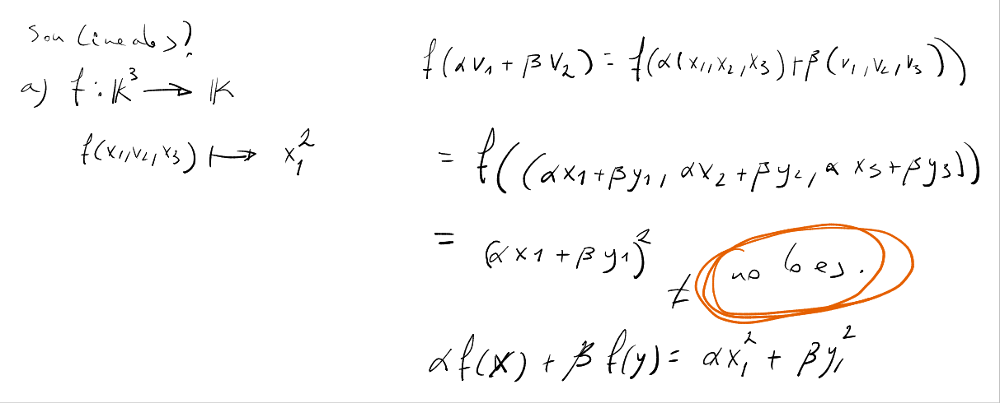
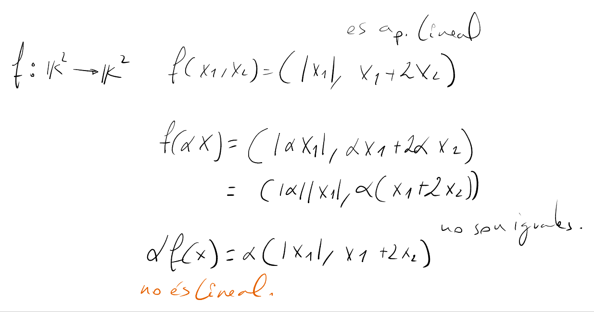
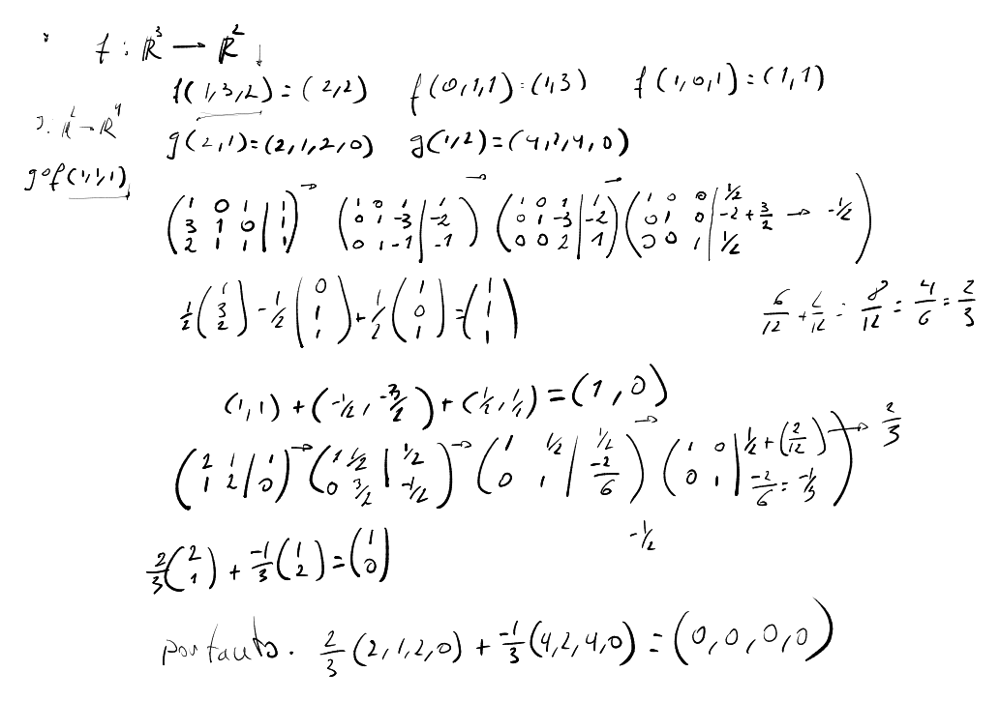
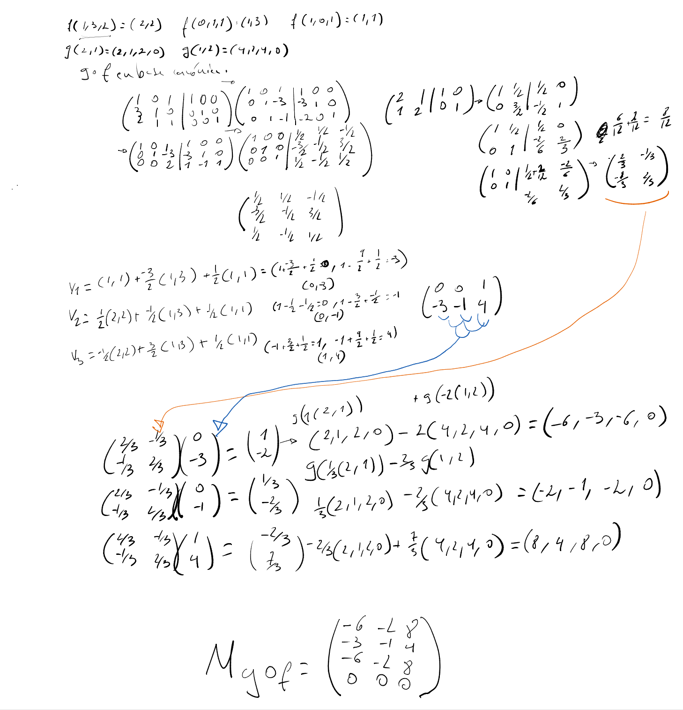

#+title: Álgebra Lineal
#+author: Jordi Amposta Pérez
#+startup: latexpreview content

* Matrices
- *Matrices congruentes* [[id:AlgbLin]] pag 46
      - $A$ y $B$ son congruentes si existe una Matriz P del mismo orden tal que.
      - $B=P^tAP$
      - Además $rg(A) = rg(AP) = rg(P^tAP) = rg(B)$
- *Matrices Semejantes*
      - $A$ y $B$ son semejantes si existe una Matriz $P$ del mismo orden tal que.
      - $B = P^{-1}AP$
      - además $rg(A) = rg(AP) = rg(P^{-1}AP) = rg(B)$

* Espacios Vectoriales
- Cálculo de *ecuaciones implícitas* de un espacio vectorial [[id:AlgbLin]] pag 136

* Aplicaciones Lineales
- $f: U \to V$
  $\dim(U) = \dim(Ker(f)) + \dim(Im(f))$

** Endomorfismo
- Es una palicación lineal de un espacio vectorial en si mismo.
      - $f: V \to V$

** Proyecciones y simetrías
# TODO

** Espacio Dual
- *Forma lineal*, aplicación lineal de $V$ en $\mathbb{K}$.
      - $f: V \to \mathbb{K}$
- *Espacio Dual*, conjunto de formas lineales de $V$.
      - $V^* = \mathcal{L}(V,\mathbb{K}) \simeq \mathfrak{M}_{1 \times n}$

** Ejercicios

* Aplicaciones Lineales

** Endomorfismos
- Las matrices de un endomorfismo en distintas bases son semejantes.
- $\mathfrak{M}_{B'}(f) = \mathfrak{M}_{BB'} \mathfrak{M}_B(f) \mathfrak{M}_{B'B}$
      - En palabras : Cojemos $v_{B'}$ lo transformamos en $v_{B}$ aplicamos la transformación y devolvemos el resultado a $B'$.

* Formas Canónicas de endomorfismos
- [[id:AlgbLin]] pag 199

** Autovalores y autovectores. Endomorfismos diagonalizbales
- [[id:AlgbLin]] pag 207
- Sean $\lambda_1 \dots \lambda_r$ autovalores del endomorfismo $f$ de $V$, con $dimV=n$.
- *Multiplicidad algebraica* : multiplicidad de la raiz $\lambda_i$ del polinomio característico.
      - Se denota por $a_i$.
      - $\lambda_i$ es un autovalor.
- *Multiplicidad Geométrica* : Dimensión del subespacio asociado $V_{\lambda}$.
      - Se denota por $g_i$.
      - $g_i = dim V_{\lambda_i} = n - rg(A - \lambda_i I)$
            - $g_i \geq 1$
- La multiplicidad algebraica de un autovalor es igual o mayor que la multiplicidad geométrica.
- $f$ es diagonalizable si:
      - $a_1 + \dots + a_k = n$
      - $a_i = g_i$ para cada valor $\lambda_i$

** Forma canónica de Jordan
- [[id:AlgbLin]] pag 211

- Sea $\lambda$ un autovalor de $f$.  
      - Bloque Jordan de orden 2
\begin{equation*}
B_2 = \left( \begin{array}{cc}
\lambda & 0 \\
1       & \lambda
\end{array} \right)
\end{equation*}

      - Bloque Jordan de orden 3

\begin{equation*}
B_3 = \left( \begin{array}{ccc}
\lambda & 0       & 0 \\
1       & \lambda & 0 \\
0       & 1       & \lambda
\end{array} \right)
\end{equation*}

- Matriz Jordan con 2 Bloques Jordan.
  
\begin{equation*}
J = \left(\begin{array}{cc|cc}
  \lambda  & 0        & 0    & 0 \\
  1        & \lambda  & 0    & 0 \\ \hline
  0        & 0        & \mu  & 0 \\
  0        & 0        & 1    & \mu
\end{array} \right)
\end{equation*}

- Un autovalor $\lambda_i$ tiene tantos bloques Jordan como su multiplicidad geométrica $g_i$.
      - Se debe igualar la multiplicidad algebraica en la diagonal de la matriz Jordan.
- Un subespacio $U$ de $V$ es *invariante* por un endomorfismo $f$ de $V$, o $f-invariante$, si se cumple $f(U) \subseteq U$.
      - Si $U=L(v_1, \dots, v_k)$ entonces $f(v_i) \in U$, $i=1 \dots k$.
- Sean $f$ un endomorfismo de $V$, $U_1,\dots,U_k$ subespacios de $V$ invariantes por $f$, y $B_i$ una base de $U_i$, $i \in 1,\dots, k$.
      - Si $V=U_1 \oplus \dots \oplus U_k$
      - Entonces $f$ respecto a $B=B_1 \cup \dots \cup B_k$ de $V$ Es una matriz diagonal por bloques.
      - [[id:AlgbLin]] pag 212

- Se denomina *Subespacio propio generalizado* i-ésimo asociado a un autovalor $\lambda$ de un endomorfismo $f$ al subespacio vectorial:
      - $K^i(\lambda) = Ker(f-\lambda Id)^{i}$ para $i = 1,2,\dots$
      - El subespacio propio generalizado $K^1(\lambda) = V_{\lambda}$
      - $M(\lambda)$ es el subespacio $K^i(\lambda)$ máximo.
            - $dim M(\lambda) = a_{\lambda}$.

- Propiedades de *Subespacio propio generalizados* ([[id:AlgbLin]] pag 218)
      1. Los subespacios propios generalizados son f-invariantes.
      2. $K^i(\lambda) \subseteq K^{i+1} (\lambda)$
      3. $v \in K^i(k)$ si y solo si $(f - \lambda Id)(v) \in k^{i-1}(\lambda)$
      4. Existe un $k > 0$ tal que se tiene la cadena ascendente de subespacios hasta alcanzar uno de dimensión máxima.
             - $V_{\lambda} = K^1(\lambda) \subsetneq K^2(\lambda) \subsetneq \cdots \subsetneq K^k(\lambda) = \cdots = k^j(\lambda)$, para $j > k$
             - Se denomina *subespacio máximo* asociado a $\lambda$ al subespacio
               $M(\lambda) = k^k(\lamdba) = Ker(f-\lambda Id)^k$
      5. La diferencia entre subsespacios generalizados es decreciente.
             - $d_i = dim K^i(\lambda)$, para $i = 1,2,\cdots$
             - $r_i = d_i - d_{i-1}$, para $i=2,3,\cdots$
             - $r_2 \geq r_3 \geq \cdots \geq r_k$

- *Base asociada a un bloque de Jordan* de orden n: ([[id:AlgbLin]] pag 215)
      - $B=\{v_1, (f-\lambda Id)(v_1), \dots, (f-\lambda Id)^{n-1}(v_1)\}$
            - $v_1 \in Ker(f-\lambda Id)^n - Ker(f - \lambda Id)^{n-1}$
            - $v_i \in ker(f - \lambda Id)^r - ker(f-\lambda Id)^{r-1}$
                  - generalizando, siendo $v_i$ un vector del subpespacio $k^r$ no presente en $k^{r-1}$.
                  - $v_i$ forma parte de la base asociada a un blque Jordan.
                  - El conjunto de bases forman la matriz $P$ tal que $P^{-1}AP=J$.

- La *dimensión* del subespacio máximo $M(\lambda)$ coincide con la multiplicidad algebraica de $\lambda$.

- Construcción de la base $P$ tal que $P^{-1}AP = J$
  | dim | dim k^1             |         | ... |         | dim k^n = a_{\lambda}     |   | dimensión de cada subespacio k^i(\lambda)                        |
  |-----+---------------------+---------+-----+---------+---------------------------+---+------------------------------------------------------------------|
  |     | K^1(\lambda)        | \subset | ... | \subset | k^n(\lambda) = M(\lambda) |   | De cada subespacio K^n se cogen (dim k^n - dim k^{n-1}) vectores |
  |-----+---------------------+---------+-----+---------+---------------------------+---+------------------------------------------------------------------|
  |     | v_n                 |         | ... |         | v_1                       |   | Cada fila Está asociada a un bloque Jordan de la matriz J        |
  |     | (posible) v_{n+1+m} |         | ... |         | (posible) v_{n+1}         |   | g_{\lambda} es igual al número de filas de vectores              |
              
- *Espacio r-cíclico*.
      - Sea $\lambda$ un autovalor del endomorfismo $f$ de $V$.
      - Y $v \in Ker(f-\lambda Id)^r - Ker(f-\lambda Id)^{r-1}$ con $r \geq 1$.
      - Entonces $L(v, (f-\lambda Id)(v), \dots, (f-\lambda Id)^{r-1}(v))$ es el espacio r-cícliclo.

- si $B=\{v_1, \dots, v_n\}$ tal que $\mathfrak{M}_B(f)=B_n(\lambda)$
      - Entonces si $B' = \{v_n, \dots, v_1\}$ $\mathfrak{M}_{B'}(f) = B_n(\lambda)^t$
      - $\left(\begin{array}{cc} 0 & 1 \\ 1 & 0 \end{array}\right) \left(\begin{array}{cc} \lambda & 0 \\ 1 & \lambda \end{array}\right) \left(\begin{array}{cc}0 & 1 \\ 1 & 0\end{array}\right) = \left(\begin{array}{cc}\lambda & 1 \\ 0 & \lambda \end{array}\right)$

- *Teorema de existencia* :
  Sea $f$ un endomorfismo de un espacio vectorial $V$ de *dimensión* $n$.
  Existe una base $\mathcal{B}$ de $V$ tal que la matriz $\mathfrak{M}_B(f)$ es una matriz de *Jordan* si y solo si
  $f$ tiene $n$ autovalores contados con su multiplicidad algebraica.

- *Forma canónica de Jordan* :
  Si existe una base $\mathcal{B}$ de $V$ tal que la matriz de $f$ respecto a dicha
  base es una matriz de Jordan $J$.
  Es única salvo permutación de los bloques.

- *Teorema de Jordan* :
  Sean $f$ y $g$ dos endomorfismos de un espacio vectorial $V$ con $r$ autovalores $\lambda$ distintos que
  admiten forma canónica de Jordan y sus polinomios característicos coinciden.
  Entonces son *linealmente equivalentes* (semejantes, $F = P^{-1}GP$ ) si y solo si
  $\displaystyle dim K_f^i(\lambda_j) = dim K_g^i(\lambda_j)$ para todo $j=1,\cdots,r$; $i=1,2,\cdots$

** Forma Real de Jordan

[[id:AlgbLin]] pag 231
- Si $\lambda=a+bi$ es una raiz compleja de $p_f(\lambda)$ el *conjugado también lo es*.
      - $\lambda-a+bi$ el conjugado es $\bar{\lambda}=a-bi$

- Cada vez que tengamos raíces complejas conjugadas en la matriz canónica real aparecerán bloques 2x2 tal que
  $\displaystyle \left( \begin{array}{cc} a & b \\ -b & a \end{array}\right)$
  
- $\hat{V}$ es la *extensión compleja* de $V$.
      - $\hat{V}$ es un espacio vectorial complejo de la misma dimensión que $V$.
      - $\hat{V} = \{u + wi\ :\ u,w \in V\}$
      - $V \subset \hat{V}$
- Si $B$ es una base de $V$ también es una base de $\hat{V}$

- *Extensión compleja* de $f$ es $\hat{f}$ de $\hat{V}$.
      - $\displaystyle \hat{f}(u + wi) = f(u) + f(w)i$
      - $p_f(\lambda) = p_{\hat{f}}(\lambda) = det(A - \lambda Id)$

- Si $\mathcal{B} = \{v_1, \dots ,v_r\}$ es una base de Jordan de $M(\lambda)$,
  entonces $\bar{\mathcal{B}} = \{\bar{v_1}, \dots, \bar{v_r}\}$ es una base de Jordan $M(\bar{\lambda})$.
      - $\lambda$ y $\bar{\lambda}$ Generan bloques jordan $B(\lambda)$ y $B(\bar{\lambda})$ con la misma estructura.

- *Forma de Jordan Real* $J_{\mathbb{R}}(f)$ :
      - Se forma a partir de la forma compleja $\hat{J}$.
      - Cambiamos bloques complejos $B_j(\lambda)$ $B_j(\bar{\lambda})$ por un bloque $C_{2j}(\lambda)$.

      - $$
        C_{2j}(\lambda) = \left( \begin{array}{cccc}
        C(\lambda) & 0 & 0 & 0 \\
        I_2 & C(\lambda) & 0 & 0 \\
        0 & \ddots & \ddots & 0 \\
        0 & 0 & I_2 & C(\lambda)
        \end{array}
        \right)
        $$

      - con $C(\lambda) = \left(\begin{array}{cc} a & b \\ -b & a \end{array} \right)$
      - $I_2 = \left( \begin{array}{cc} 1 & 0 \\ 0 & 1 \end{array} \right)$
      - Sustituyendo en $B_j(\lambda)$ cada 1 por $I_2$ y cada $\lambda$ por $C(\lambda)$

- $B' = \{v_1, v_2, u_1, u_2\}$ forman una base tal que $\mathfrak{M}_{B'}(f) = J_{\mathbb{R}}(f)$.
      - $f$ ya está en forma compleja de Jordan.
        Primero necesitamos $B$ como la base de la forma canónica compleja de Jordan.
      - $v$ y $u$ son los vectores complejos de la base de la forma compleja de Jordan.
            - $u$ el propio autovector.
      - $v = v_1 + v_2i$ y $u = u_1 + u_2i$
      - Se generaliza a todos lo bloques Jordan de la matriz.

* Subespacios invariantes

** Polinomio mínimo
- $p(t)$ es *polinomio anulador* de $f$ si $p(f)$ es un endomorfismo nulo.
      - $p(f)=0$ o $p(A)=0$

- *Teorema de Cayler-Hamilton*
  El *polinomio característico* de un endomorfismo es un polinomio anulador de $f$.
        
- Sea $p(t) \in \mathbb{K}[t]$ un polinomio anulador de un endomorfismo de $f$ de $V$.
  Si $p=p_1 . p_2$ siendo $p_1$ y $p_2$ de grado igual o mayor a 1, tales que su máximo común divisor es una *constante*, entonces

  $V = Ker(p_1(f)) \oplus ker(p_2(f))$

- Todo autovalor de un endomorfismo es raiz de cualquier polinomio anulador de $f$.

- *Polinomio mónimo* : el coeficiente principal es $a_k=1$.
- *Polinomio mínimo anulador* :
  Polinomio mónico $mf(t)$ de $\mathbb{K}[t]$ de grado mínimo que anula a $f$.

- Todo polinomio anulador de un endomorfismo es múltiplo del *polinomio mínimo*.
- El polinomio mínimo es divisor del polinomio caracterísitco, y tiene sus mismas raizes.
  Pero no la misma multiplicidad.

- Sea un endomorfismo $f$ de un $\mathbb{K}$-espacio vectorial de dimensión $n$ cuyo polinomio característico es de la forma
  $p_f(t) = (-1)^n(t-\lambda_1)^{\alpha_1}\cdots (t-\lambda_k)^{\alpha_k}$,    $\alpha_1 + \cdots + \alpha_k = n$ 
  El subespacio máximo asociado a $\lambda_i$ es $M(\lambda_i) = Ker(f - \lambda_i Id)^{l_i}$,
  El polinomio mínimo anulador de $f$ es:
  $$
  m_f(t) = (t-\lambda_1)^{l_1} \cdots (t-\lambda_k)^{l_k}
  $$

- $f$ es diagonalizable si y solo si su polinomio mínimo no tiene raíces múltiples.

- Si $A \in \mathfrak{M}_n(\mathbb{K})$ es una matriz cuyo polinomio mínimo es de grado $m$,
  entonces $m$ es el menor entero positivo tal que las matrizes
  $A^m, A^{m-1}, \dots , A, A^0=I$ son linealmente dependientes.

* Isometrías vectoriales
** Definición y caracterizaciónes

- Sean $(V, <,>)$ y $(V',<,>')$ dos espacios vectoriales euclídeos. Una aplicación lineal $f: V \to V'$ es una *isometría vectorial* o *transformación ortogonal* si cumple.
  $<u,v> = <f(u), f(v)>'$ para todo $u,v \in V$

- *Propiedades de las isometrías*
      1) Conserva la norma: $||u|| = ||f(u)||'$ para todo $u \in V$
      2) Conserva los ángulos: $\angle(u,v) = \angle(f(u), f(v))$ para todo $u,v \in V$
      3) Es inyectiva
      4) Si $\dim V = \dim V'$, entonces es un isomorfismo.
      5) Transforma una base ortonormal de $V$ en una base orotonormal de $V'$
         

* Bibliografía
** Algebra Lineal y Geometría Vectorial
:PROPERTIES:
:ID: AlgbLin
:EDITORIAL: Sanz y Torres
:AUTHOR: Alberto Borobia Vizmanos, Beatriz Estrada López
:END:

